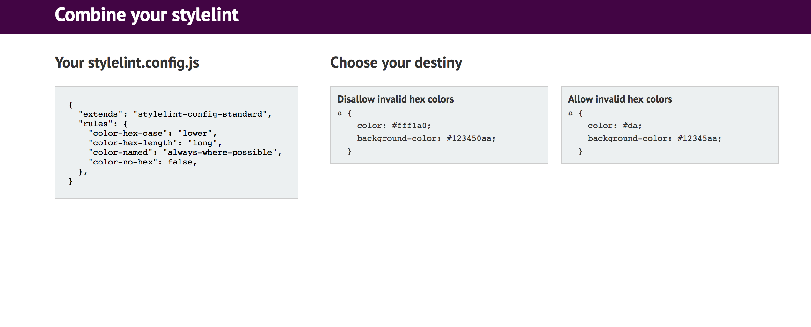

## Combiner

This is a tool to generate stylelint file just like
[cssComb](http://csscomb.com/config).

More information about [Stylelint](https://stylelint.io)

For now I've made several questions about colors and blocks and looking for better architecture to make quiz.



---

I have used ```create-react-app```

To run the example
```
npm install
npm start
```
