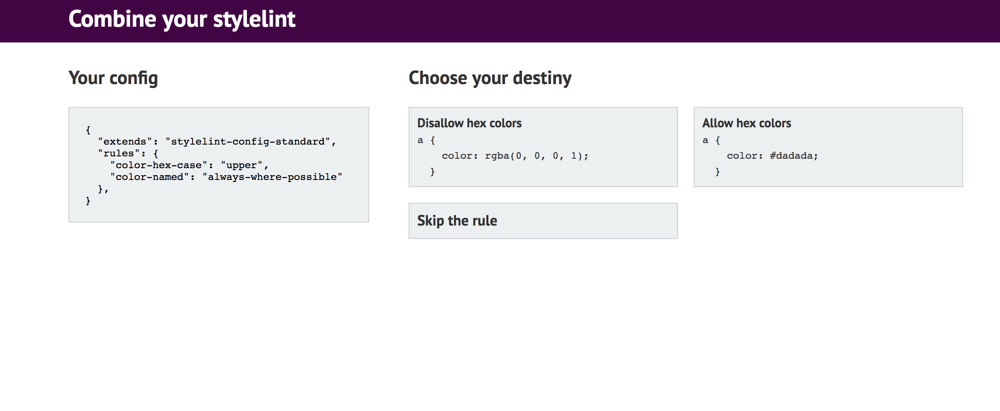

## Combiner

This is a tool to generate stylelint file just like
[cssComb](http://csscomb.com/config).

More information about [Stylelint](https://stylelint.io)



---

I used ```create-react-app```

To run the example
```
npm install
npm start
```
---
### Opinion

List of rules for now:

#### colors
- color-hex-case
- color-hex-length
- color-named
- color-no-hex
- color-no-invalid-hex

#### strings
- string-no-newline
- string-quotes

#### numbers
- number-leading-zero
- number-no-trailing-zeros

#### at-rules
- at-rule-name-case
- at-rule-name-space-after

#### blocks
- block-closing-brace-empty-line-before
- block-closingbrace-newline-before
- block-closing-brace-space-before
- block-no-empty
- block-opening-brace-newline-after
- block-opening-brace-newline-before
- block-opening-brace-space-after
- block-opening-brace-space-after

---
todo

to pass only rules are included in stylelint-config-standard
which i find most controversial.

future list:
- at-rule-name-case
- color-hex-case
- color-hex-length
- block-closing-brace-empty-line-before
- block-closing-brace-space-before
- block-no-empty
- block-opening-brace-space-after
- block-opening-brace-space-before
- comment-whitespace-inside
- declaration-block-semicolon-newline-after
- declaration-block-semicolon-space-before
- declaration-colon-space-after
- declaration-colon-space-before
- media-feature-colon-space-after
- media-feature-colon-space-before
- media-feature-name-case
- selector-attribute-brackets-space-inside
- selector-attribute-operator-space-after
- selector-combinator-space-after
- selector-combinator-space-after
- selector-list-comma-space-before
- selector-pseudo-class-parentheses-space-inside
- selector-pseudo-element-colon-notation
